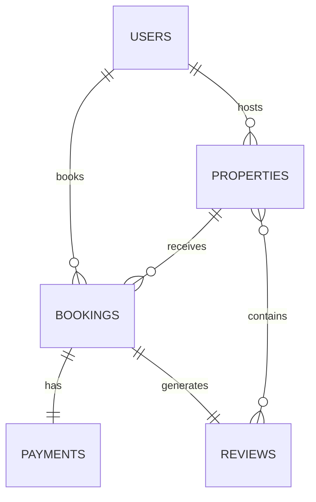
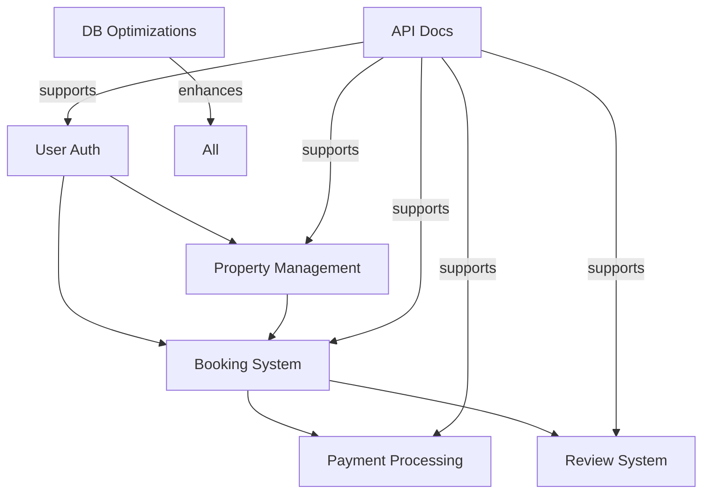

# Airbnb Clone Project

## Overview

A backend stack of Airbnb, replicating core functionalities like user interactions,
property listings, bookings, user authentication, payments and reviews. This project is
part of my learning curriculum to master modern web development through the ALX program.

## Table of Content

- [Airbnb Clone Project](#airbnb-clone-project)
  - [Overview](#overview)
  - [Table of Content](#table-of-content)
  - [Team Roles](#team-roles)
    - [Role Collaboration](#role-collaboration)
  - [Technology Stack](#technology-stack)
  - [Database Design Overview](#database-design-overview)
    - [Key Entities](#key-entities)
      - [1. Users](#1-users)
      - [2. Properties](#2-properties)
      - [3. Bookings](#3-bookings)
      - [4. Reviews](#4-reviews)
      - [5. Payments](#5-payments)
    - [Entity Relationship Diagram (Concept)](#entity-relationship-diagram-concept)
  - [Feature Breakdown](#feature-breakdown)
    - [1. API Documentation](#1-api-documentation)
    - [2. User Authentication](#2-user-authentication)
    - [3. Property Management](#3-property-management)
    - [4. Booking System](#4-booking-system)
    - [5. Payment Processing](#5-payment-processing)
    - [6. Review System](#6-review-system)
    - [7. Database Optimizations](#7-database-optimizations)
      - [Key Feature Relationships](#key-feature-relationships)

## Team Roles

Each member will specialize in one or more roles throughout the project lifecycle.

|Role                                         |Responsibilities                        |
|---------------------------------------------|----------------------------------------|
|**Project Manager**                          |Oversees the timeline, coordinates tasks, facilitates communication, manages risks.|
|**Backend Developer**                        |Develops API endpoints, implements business logic, integrates services.|
|**Frontend Developer**                       |Implements UI components, ensures responsive design, manages client-side state.|
|**Database Admin**                           |Design schema, optimize queries, ensures data integrity and security.|
|**DevOps Engineer**                          |Configure deployment pipelines, manages cloud infrastructure, monitors performance.|
|**UX/UI Designer**                           |Creates wireframes, designs interfaces, ensures intuitive user experience.|
|**QA Tester**                                |Develops test cases, performs manual/automated testing, reports bugs.|
|**Full Stack Developer**                     |Bridges frontend-backend, implements end-to-end features, assists both teams.|

### Role Collaboration

- Frontend/Backend developers collaborate on API contracts.
- DB Admin works with Backend on query optimization.
- DevOps supports all teams with deployment automation.
- QA works across all components for quality assurance.

## Technology Stack

This project will utilize a modern , scalable technology stack:

|Technology                                   |Purpose in Project                      |
|---------------------------------------------|----------------------------------------|
|**Django**                                   |Core backend framework for building web applications and RESTful APIs.                      |
|**Django REST Framework**                    |Toolkit for building powerful, flexible REST APIs with authentication features.                      |
|**PostgreSQL**                               |Relational database for structured data storage with ACID compliance.                      |
|**GraphQL**                                  |Alternative query language for efficient data fetching with client-specified needs.                      |
|**Celery**                                   |Asynchronous task processing for background jobs( email, payments, notifications, etc.).                      |
|**Redis**                                    |In-memory data store for caching, session management, and message brokering.                      |
|**Docker**                                   |Containerization for consistent environments across development and deployment.                      |
|**CI/CD Pipelines**                          |Automated testing and deployment workflows for rapid, reliable releases.                      |

## Database Design Overview

The database schema is designed around the core entities with their relationships:

### Key Entities

#### 1. Users

**Fields**:

- `id` (Primary Key)
- `email`(Unique)
- `password_hash`
- `first_name`
- `last_name`
- `user_type`
- `created_at`

**Relationships**:

- One-to-Many with Properties (Host)
- One-to-Many with Bookings (Guest)
- One-to-Many with Reviews (Author)

#### 2. Properties

**Fields**:

- `id` (Primary Key)
- `title`
- `description`
- `price_per_night`
- `bedrooms`
- `location` (PostGIS geography)
- `host_id` (Foreign Key to Users)

**Relationships**:

- Many-to-One with Users (Host)
- One-to-Many with Bookings
- One-to-Many with Reviews
- Many-to-Many with Amenities (through PropertyAmenities)

#### 3. Bookings

**Fields**:

- `id` (Primary Key)
- `check_in_date`
- `check_out_date`
- `total_price`
- `status` (Pending/Confirmed/Cancelled)
- `guest_id` (Foreign Key to Users)
- `property_id` (Foreign Key to Properties)

**Relationships**:

- Many-to-One with Users (Guest)
- Many-to-One with Properties
- One-to-One with Payments
- One-to-One with Reviews

#### 4. Reviews

**Fields**:

- `id` (Primary Key)
- `rating` (1-5)
- `comment`
- `created_at`
- `booking_id` (Foreign Key to Bookings)
- `author_id` (Foreign Key to Users)

**Relationships**:

- Many-to-One with Bookings
- Many-to-One with Users (Author)
- Many-to-One with Properties (through Booking)

#### 5. Payments

**Fields**:

- `id` (Primary Key)
- `amount`
- `payment_method`
- `transaction_id`
- `status` (Succeeded/Failed)
- `booking_id` (Foreign Key to Bookings)

**Relationships**:

- One-to-One with Bookings

### Entity Relationship Diagram (Concept)

## Feature Breakdown

### 1. API Documentation

**Implementation**:

- OpenAPI standard for REST endpoints
- Django REST Framework's browseable API
- GraphQL schema
**Purposes**:
Provides clear, interactive documentation for both REST and GraphQL APIs, enabling
seamless frontend-backend integration and third-party developer onboarding. Ensures API
consistency and discoverability throughout the project lifecycle.

### 2. User Authentication

**Components**:

- JWT-based authentication
- Password hashing
- Role-based access control
**Functionality**:
Securely manage user registration, login, and profile management. Supports both guest
and host roles with appropriate permissions, protecting sensitive operations like
property modifications and payment processing.

### 3. Property Management

**Capabilities**:

- CRUD operations for property listings
- Geolocation search (PostGIS)
- Availability calendar integration
**Value**:
Enables hosts to create and manage listings with rich metadata (amenities, photos,
pricing rules). Provides guests with powerful search filtering, and discovery tools
for finding accommodations.

### 4. Booking System

**Workflow**:  

- Date conflict validation  
- Dynamic pricing calculation  
- Booking status lifecycle  
**Process**:  
Manages reservation creation, modification, and cancellation. Integrates with property calendars to prevent double-booking and calculates totals based on seasonal pricing, cleaning fees, and taxes.

### 5. Payment Processing

**Integration**:  

- Stripe/PayPal gateway support  
- PCI-compliant transaction handling  
- Receipt generation  
**Security**:  
Processes payments asynchronously via Celery, storing only minimal transaction metadata. Implements idempotency keys to prevent duplicate charges and provides booking-specific payment histories.

### 6. Review System

**Features**:  

- Rating system (1-5 stars)  
- Verified guest reviews  
- Host response functionality  
**Trust Building**:  
Allows guests to leave reviews only for completed stays, ensuring authentic feedback.
Hosts can respond to reviews, creating accountability and transparency in the community.

### 7. Database Optimizations

**Techniques**:  

- PostgreSQL query indexing  
- Redis caching layer  
- Connection pooling  
**Performance**:  
Ensures sub-second response times for frequent queries (property searches, availability checks). Reduces database load through intelligent caching and optimized index strategies.

#### Key Feature Relationships

